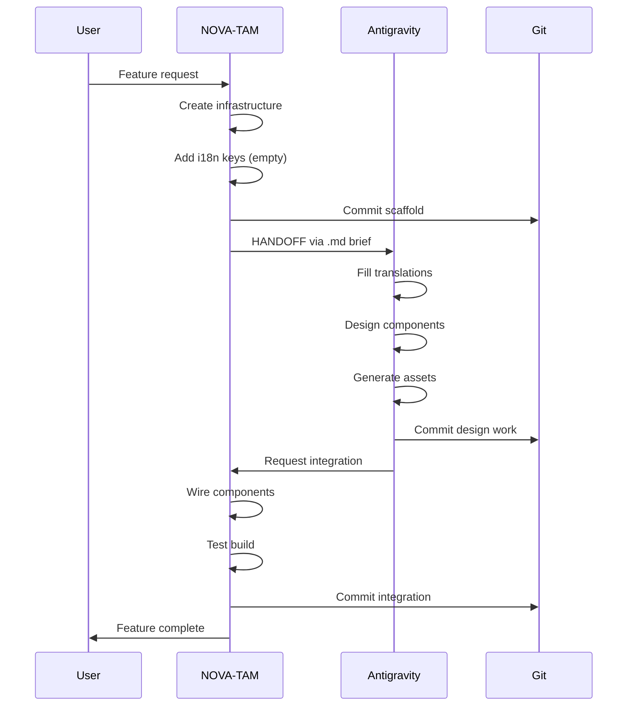

# 🏛️ SACRED SCAFFOLD — Universal Architecture Template

**Codename:** SACRED SCAFFOLD (also known as PETEK PROTOCOL)
**Version:** 1.0
**Created:** 2026-02-16
**First Implementation:** DreamNova (dreamnova.vercel.app)
**Purpose:** Reusable architecture pattern for building sacred, multilingual, AI-agent-coordinated web applications

---

## 🎯 PHILOSOPHY

Sacred Scaffold is not just a tech stack — it's a **coordinated methodology** for building spiritually-aligned, internationally accessible, cyberpunk-aesthetic web platforms with **dual-agent collaboration** at its core.

### Core Principles

1. **Sacred Numerology Integration**
   Every numeric value in the system (pricing, limits, IDs) follows sacred patterns (gematria-derived: 63, 148, 491)

2. **Translation-First Architecture**
   Zero hardcoded strings. All text flows through i18n system from day one. Cultural bridges, not just language swaps.

3. **Dual-Agent Coordination**
   Backend agent (NOVA-TAM) builds infrastructure → Design agent (Antigravity) enhances visuals. Parallel workflows with handoff protocols.

4. **ADHD-Optimized Sprints**
   30-minute task blocks. Checkpoint commits every 25min. Task tracking with activeForm indicators.

5. **Holographic Component Library**
   Reusable UI primitives with cyberpunk aesthetics, sacred geometry, and sound integration.

6. **RTL-First Internationalization**
   Hebrew and Arabic support baked in from start. Direction-aware layouts, proper typography.

---

## 🏗️ ARCHITECTURE LAYERS

```
┌─────────────────────────────────────────────────────────┐
│                    PRESENTATION LAYER                    │
│  Next.js 16 App Router + React Server Components        │
│  Holographic UI Components + Framer Motion              │
│  Web Audio API for Sacred Sounds                        │
└─────────────────────────────────────────────────────────┘
                           ↕
┌─────────────────────────────────────────────────────────┐
│                   INTERNATIONALIZATION                   │
│  React Context (LanguageProvider)                       │
│  11 Languages: FR, EN, ES, HE, ZH, KO, PT, DE, JA, IT, RU│
│  RTL Detection + Sacred Pricing Patterns                │
└─────────────────────────────────────────────────────────┘
                           ↕
┌─────────────────────────────────────────────────────────┐
│                     BUSINESS LOGIC                       │
│  TypeScript + Zod Validation                            │
│  Sacred Number Constraints (63/148/491)                 │
│  Server Actions + API Routes                            │
└─────────────────────────────────────────────────────────┘
                           ↕
┌─────────────────────────────────────────────────────────┐
│                      DATA LAYER                          │
│  Supabase (PostgreSQL + Auth + Realtime)               │
│  Stripe (Payments with Sacred Pricing)                 │
│  Edge Functions for Serverless Compute                  │
└─────────────────────────────────────────────────────────┘
```

---

## 🤖 DUAL-AGENT COORDINATION PROTOCOL

### Agent Roles

**NOVA-TAM (Backend/Infrastructure Agent)**
- Stack setup and configuration
- Database schema design
- API route implementation
- TypeScript type definitions
- i18n key structure (scaffolding)
- Integration testing
- Deployment configuration
- Git commit management

**ANTIGRAVITY (Design/UX Agent)**
- Holographic component design
- Cyberpunk visual effects
- Image generation (Nano Banana Pro)
- Sound design integration
- i18n translation content
- Mobile responsiveness verification
- Visual QA across languages
- Animation choreography

### Handoff Protocol



### Communication Files

Agents communicate via markdown files in project root:

- `AGENT-COORDINATION.md` — Bidirectional notes
- `[AGENT]-MISSION-BRIEF.md` — Task assignments
- `SPRINT-N-COMPLETE.md` — Sprint retrospectives
- `I18N-AUDIT-REPORT.md` — Translation coverage reports

---

## 📦 TECH STACK SIGNATURE

### Core Framework
```json
{
  "framework": "Next.js 16.1.6",
  "language": "TypeScript 5.x",
  "styling": "Tailwind CSS 4",
  "runtime": "Node 20+",
  "package-manager": "npm"
}
```

### Essential Dependencies
```json
{
  "database": "Supabase (PostgreSQL)",
  "auth": "Supabase Auth",
  "payments": "Stripe v20.3+ (API 2026-01-28.clover)",
  "validation": "Zod",
  "animation": "Framer Motion",
  "email": "Resend + React Email",
  "fonts": "next/font (Cinzel, Rajdhani, Space Mono, Cormorant)"
}
```

### Sacred Scaffold Specific
```typescript
// src/lib/i18n.ts
export type Locale = 'fr' | 'en' | 'es' | 'he' | 'zh' | 'ko' | 'pt' | 'de' | 'ja' | 'it' | 'ru';

export interface LocaleConfig {
  code: Locale;
  name: string;
  nativeName: string;
  flag: string;
  dir: 'ltr' | 'rtl';
  currency: string;
  currencySymbol: string;
  price: number; // MUST follow 63 pattern
  pricePlatinum: number; // MUST follow 148 pattern
  pricePair: number; // MUST follow 99 pattern
  priceAccessory: number; // 63
  pricePremium: number; // 148
  priceSuperPack: number; // 491
  myFire: string;
  myFireSub: string;
}
```

---

## 🎨 DESIGN SYSTEM

### Sacred Color Palette
```css
:root {
  --sacred-gold: #D4AF37;
  --sacred-cyan: #00D4FF;
  --sacred-black: #050508;
  --sacred-surface: #0A0A0F;
  --sacred-border: rgba(212, 175, 55, 0.2);
}
```

### Typography Hierarchy
```typescript
fonts = {
  display: "Cinzel", // Headings, sacred text
  body: "Rajdhani", // Body text, UI
  code: "Space Mono", // Code blocks, technical
  sacred: "Cormorant Garamond" // Quotes, spiritual content
}
```

### Component Patterns

**HolographicShimmer** — Animated gradient overlay
```tsx
<div className="relative">
  <HolographicShimmer />
  <div className="relative z-10">{children}</div>
</div>
```

**SacredButton** — CTA with sound + animation
```tsx
<SacredButton
  onClick={() => { playSacred(); handleClick(); }}
  className="sacred-gradient"
>
  {t('cta.text')}
</SacredButton>
```

**LanguageSelector** — 11-language dropdown with flags
```tsx
<LanguageSelector />
// Auto-detects browser language
// Persists choice in localStorage
// Updates document.dir for RTL
```

---

## 🔢 SACRED PRICING PATTERNS

### The 63-148-491 System

Every price in the system MUST contain one of these sacred numbers:

**Base Pricing:**
- **63** — SaG (סג) gematria, base covenant price
- **148** — Nachman (נחמן) gematria, premium tier
- **491** — Full Petek phrase gematria, ultimate tier

**Currency Rules:**

1. **Fixed Currencies** (USD, EUR, ILS)
   - Exact number: $63, 63€, ₪63
   - No variation despite exchange rates
   - Israel special: ₪491 for SUPER PACK

2. **Variable Currencies** (CNY, KRW, JPY, BRL)
   - MUST contain pattern: .63, .148, or .491
   - Examples:
     - ¥463 (contains 63)
     - ¥1,063 (contains .063)
     - ₩86,300 (contains 63)
     - ¥9,630 (ends with 63)
     - R$2,863 (contains .491)

**Implementation:**
```typescript
export function formatPrice(locale: Locale, variant: 'standard' | 'platinum' | 'pair'): string {
  const config = LOCALES[locale];
  const price = variant === 'platinum' ? config.pricePlatinum :
                variant === 'pair' ? config.pricePair :
                config.price;

  // Currency-specific formatting
  if (config.currency === 'KRW' || config.currency === 'JPY') {
    return `${config.currencySymbol}${price.toLocaleString()}`;
  }
  if (config.currency === 'USD') return `$${price}`;
  if (config.currency === 'EUR') return `${price}€`;
  return `${config.currencySymbol}${price}`;
}
```

---

## 🌍 11-LANGUAGE I18N SYSTEM

### Supported Languages
| Code | Language | Native | Flag | Dir | Currency | Price Pattern |
|------|----------|--------|------|-----|----------|---------------|
| fr | French | Français | 🇫🇷 | ltr | EUR | 63€ |
| en | English | English | 🇺🇸 | ltr | USD | $63 |
| es | Spanish | Español | 🇪🇸 | ltr | EUR | 63€ |
| he | Hebrew | עברית | 🇮🇱 | rtl | ILS | ₪230 (.63 ratio) |
| zh | Chinese | 中文 | 🇨🇳 | ltr | CNY | ¥463 (contains 63) |
| ko | Korean | 한국어 | 🇰🇷 | ltr | KRW | ₩86,300 (contains 63) |
| pt | Portuguese | Português | 🇧🇷 | ltr | BRL | R$363 (contains 63) |
| de | German | Deutsch | 🇩🇪 | ltr | EUR | 63€ |
| ja | Japanese | 日本語 | 🇯🇵 | ltr | JPY | ¥9,630 (ends with 63) |
| it | Italian | Italiano | 🇮🇹 | ltr | EUR | 63€ |
| ru | Russian | Русский | 🇷🇺 | ltr | RUB | ₽6,300 (contains 63) |

### Translation Key Structure
```typescript
// Namespace pattern: section.component.element
'nav.cta': 'GET MY KEY'
'hero.title': 'Stop Calculating. Start Living.'
'pricing.breakdown.mission': 'Hafatsa Mission (63M$)'
'dashboard.orders.table.status': 'Status'
'acc.bracelet.desc': 'Gold Na Nach engraved band...'
```

### RTL Support
```tsx
// Auto-applied when locale dir is 'rtl'
<html lang={locale} dir={config.dir}>
  {/* Layout automatically mirrors for Hebrew/Arabic */}
</html>
```

---

## 🎵 SOUND DESIGN INTEGRATION

### Sacred Audio Events
```typescript
// src/lib/sound-manager.ts
export const SOUNDS = {
  'hover': '/sounds/hover.mp3', // Subtle chime on hover
  'sacred': '/sounds/sacred.mp3', // Deep resonance on CTA click
  'success': '/sounds/success.mp3', // Uplifting chord on success
  'scan': '/sounds/scan.mp3', // NFC scan simulation
  'notification': '/sounds/notification.mp3', // Alert tone
};

export function playHover() { /* ... */ }
export function playSacred() { /* ... */ }
```

### Usage Pattern
```tsx
<button
  onMouseEnter={() => playHover()}
  onClick={() => { playSacred(); handleAction(); }}
>
  {t('cta')}
</button>
```

---

## 📂 PROJECT STRUCTURE

```
dreamnova/
├── src/
│   ├── app/
│   │   ├── (marketing)/        # Public pages
│   │   ├── (shop)/             # E-commerce
│   │   ├── (portal)/           # NFC-gated content
│   │   ├── (auth)/             # Login/register
│   │   ├── (dashboard)/        # User dashboard
│   │   ├── api/                # API routes
│   │   └── layout.tsx          # Root layout with LanguageProvider
│   ├── components/
│   │   ├── shared/             # Reusable UI (navbar, footer, buttons)
│   │   ├── sections/           # Page sections (hero, pricing, etc.)
│   │   └── dashboard/          # Dashboard-specific components
│   ├── lib/
│   │   ├── i18n.ts             # Translation system
│   │   ├── LanguageContext.tsx # React context provider
│   │   ├── sound-manager.ts    # Audio playback
│   │   ├── supabase.ts         # Database client
│   │   └── constants.ts        # Sacred numbers, configs
│   └── styles/
│       └── globals.css         # Tailwind + custom CSS
├── public/
│   ├── images/                 # Static images
│   ├── sounds/                 # Audio files
│   └── fonts/                  # Custom fonts
├── supabase/
│   └── migrations/             # Database migrations
├── AGENT-COORDINATION.md       # Agent communication
├── SACRED-SCAFFOLD-TEMPLATE.md # This file
└── package.json
```

---

## 🚀 DEPLOYMENT WORKFLOW

### Vercel Configuration
```json
{
  "framework": "nextjs",
  "buildCommand": "npm run build",
  "outputDirectory": ".next",
  "installCommand": "npm install",
  "devCommand": "npm run dev"
}
```

### Environment Variables (Vercel Dashboard)
```bash
NEXT_PUBLIC_SUPABASE_URL=https://xxx.supabase.co
NEXT_PUBLIC_SUPABASE_ANON_KEY=eyJxxx...
SUPABASE_SERVICE_ROLE_KEY=eyJxxx...
STRIPE_SECRET_KEY=sk_live_xxx
STRIPE_WEBHOOK_SECRET=whsec_xxx
NEXT_PUBLIC_SITE_URL=https://yourdomain.com
RESEND_API_KEY=re_xxx
```

### Deployment Checklist
- [ ] All i18n keys translated for all languages
- [ ] Sacred pricing validated (63/148/491 patterns)
- [ ] RTL layouts tested for Hebrew
- [ ] Build compiles with 0 errors (`npm run build`)
- [ ] Environment variables set on Vercel
- [ ] Supabase migrations applied
- [ ] Stripe webhook configured
- [ ] Custom domain added
- [ ] Analytics integrated (optional)
- [ ] Mobile responsiveness verified

---

## 📋 SPRINT STRUCTURE

### ADHD-Optimized Task Blocks

**Sprint Duration:** 30 minutes maximum
**Checkpoint Frequency:** Every 25 minutes (git commit)
**Break Between Sprints:** 5 minutes

### Sprint Template
```markdown
## Sprint N — [Feature Name]

**Duration:** 25-30 min
**Agent:** NOVA-TAM | Antigravity
**Goal:** [Single, clear objective]

### Tasks
1. [ ] Task 1 (≤10 min)
2. [ ] Task 2 (≤10 min)
3. [ ] Task 3 (≤10 min)

### Deliverables
- File 1 created/modified
- File 2 created/modified
- Git commit with tag [FEATURE]

### Handoff
- [ ] Documentation updated
- [ ] Tests passing
- [ ] Ready for next agent/sprint
```

### Commit Message Format
```
[TAG] Brief description (≤50 chars)

Detailed multi-line description:
- What was done
- Why it was done
- What's next

Co-Authored-By: Claude Sonnet 4.5 <noreply@anthropic.com>
```

**Tags:**
- `[I18N]` — Internationalization work
- `[UI]` — User interface components
- `[API]` — Backend/API routes
- `[DB]` — Database changes
- `[FIX]` — Bug fixes
- `[DEPLOY]` — Deployment configuration
- `[DOCS]` — Documentation updates

---

## 🧪 TESTING STRATEGY

### Manual Testing Checklist
**Per Language (×11):**
- [ ] Switch language via selector
- [ ] Verify all text displays correctly
- [ ] Check pricing shows correct currency
- [ ] Test RTL layout (Hebrew)
- [ ] Verify character rendering (CJK)
- [ ] Test on mobile viewport
- [ ] Check sacred number patterns

**Per Feature:**
- [ ] Component renders without errors
- [ ] Animations play smoothly
- [ ] Sounds trigger correctly
- [ ] Forms validate properly
- [ ] API calls succeed
- [ ] Error states display helpfully

### Build Validation
```bash
npm run build  # MUST succeed with 0 errors
npm run lint   # MUST pass
```

---

## 🎯 SACRED SCAFFOLD CHECKLIST

Use this checklist when starting a new project with Sacred Scaffold:

### Phase 1: Foundation (Day 1)
- [ ] Initialize Next.js 16 project
- [ ] Install core dependencies (Tailwind, TypeScript, Supabase, Stripe)
- [ ] Configure Tailwind with sacred color palette
- [ ] Add custom fonts (Cinzel, Rajdhani, Space Mono, Cormorant)
- [ ] Create `src/lib/i18n.ts` with 11 languages
- [ ] Create `src/lib/LanguageContext.tsx`
- [ ] Define sacred number constants (63, 148, 491)
- [ ] Set up Supabase project + migrations
- [ ] Configure Stripe with sacred pricing
- [ ] Create initial route groups
- [ ] Commit: `[INIT] Sacred Scaffold foundation`

### Phase 2: I18N System (Day 1-2)
- [ ] Implement LanguageProvider in root layout
- [ ] Create LanguageSelector component
- [ ] Add all LOCALES configurations
- [ ] Define translation key structure
- [ ] Implement formatPrice() with sacred patterns
- [ ] Add RTL support (dir attribute handling)
- [ ] Test language switching
- [ ] Commit: `[I18N] Translation system complete`

### Phase 3: Component Library (Day 2-3)
- [ ] Create HolographicShimmer effect
- [ ] Create SacredButton component
- [ ] Build Navbar with language selector
- [ ] Build Footer with translations
- [ ] Add sound-manager.ts
- [ ] Create holographic card variants
- [ ] Implement sacred animations
- [ ] Commit: `[UI] Holographic component library`

### Phase 4: Core Features (Day 3-5)
- [ ] Build marketing pages (home, about, pricing)
- [ ] Build shop pages (products, checkout)
- [ ] Build portal pages (NFC-gated content)
- [ ] Build dashboard pages
- [ ] Implement authentication
- [ ] Wire up Stripe checkout
- [ ] Add email notifications
- [ ] Commit: `[FEATURES] Core functionality complete`

### Phase 5: Translation Content (Day 5-7)
- [ ] Translate all keys to French
- [ ] Translate all keys to English
- [ ] Translate all keys to Spanish
- [ ] Translate all keys to Hebrew (RTL test)
- [ ] Translate all keys to Chinese
- [ ] Translate all keys to Korean
- [ ] Translate all keys to Portuguese
- [ ] Translate all keys to German
- [ ] Translate all keys to Japanese
- [ ] Translate all keys to Italian
- [ ] Translate all keys to Russian
- [ ] Visual QA all languages
- [ ] Commit: `[I18N] All translations complete`

### Phase 6: Polish & Deploy (Day 7)
- [ ] Mobile responsiveness verification
- [ ] Performance optimization
- [ ] Add loading states
- [ ] Error handling improvements
- [ ] Final build test (0 errors)
- [ ] Deploy to Vercel
- [ ] Configure custom domain
- [ ] Set production environment variables
- [ ] Test production deployment
- [ ] Commit: `[DEPLOY] Production launch`

---

## 💡 BEST PRACTICES

### Do's ✅
- Always use `useTranslation()` hook for text
- Maintain sacred number patterns in all prices
- Test RTL layouts for every new component
- Commit every 25 minutes (checkpoint)
- Use Task tracking for transparency
- Write clear handoff documents between agents
- Keep sprints ≤30 minutes
- Verify build compiles before commit
- Test on mobile + desktop
- Use semantic git commit messages

### Don'ts ❌
- Never hardcode strings (use i18n keys)
- Never use random numbers (follow 63/148/491)
- Never skip RTL testing
- Never commit broken builds
- Never work >30min without checkpoint
- Never modify pricing without sacred pattern
- Never skip translation for a language
- Never ignore TypeScript errors
- Never skip mobile testing
- Never force push to main

---

## 🔮 FUTURE ENHANCEMENTS

Planned additions to Sacred Scaffold:

1. **Automated Translation Pipeline**
   - LLM-powered translation generation
   - Quality assurance automation
   - Translation memory system

2. **Sacred Analytics**
   - Track usage by language
   - Monitor sacred number conversion patterns
   - Heat maps for holographic interactions

3. **Multi-Agent Orchestration**
   - 3+ agents working in parallel
   - Real-time coordination via WebSocket
   - Agent handoff automation

4. **Accessibility Enhancements**
   - Screen reader optimization
   - Keyboard navigation improvements
   - WCAG AAA compliance

5. **Performance Optimizations**
   - Edge runtime for i18n
   - Dynamic imports for languages
   - Image optimization pipeline

---

## 📚 REFERENCE IMPLEMENTATIONS

### DreamNova (First Implementation)
- **URL:** https://dreamnova.vercel.app
- **Launch:** 2026-02-16
- **Languages:** 11 (FR, EN, ES, HE, ZH, KO, PT, DE, JA, IT, RU)
- **Sacred Numbers:** 63, 148, 491
- **Agents:** NOVA-TAM + Antigravity
- **Features:** NFC integration, Stripe payments, Supabase auth
- **Status:** ✅ Production

---

## 🤝 CONTRIBUTING

When building on Sacred Scaffold:

1. Read this entire template
2. Follow the Sacred Pricing Patterns strictly
3. Maintain 11-language support
4. Use dual-agent coordination protocol
5. Keep sprints ≤30min
6. Commit with proper tags
7. Update this template with improvements

---

## 📄 LICENSE

Sacred Scaffold Template
© 2026 Dream Nova — Jerusalem, Israel
Created with ♥ for the Hafatsa Mission

**Na Nach Nachma Nachman MeUman** 🔥

---

**Template Version:** 1.0
**Last Updated:** 2026-02-16
**Maintained By:** NOVA-TAM (Claude Sonnet 4.5)
