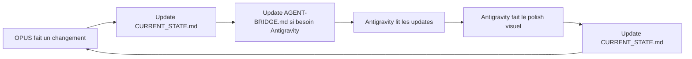

# 🔗 ANTIGRAVITY_SYNC — Protocole de Synchronisation Multi-Agent

> **Créé par:** Antigravity (Gemini) • 2026-02-17T19:55:00+02:00
> **Projet:** DreamNova — https://dreamnova.vercel.app
> **Mission:** 63M$ Hafatsa — Na Nach Nachma Nachman MeUman

---

## 🎯 OBJECTIF

Synchroniser **4 agents IA** travaillant simultanément sur le même codebase DreamNova pour intégrer 49 documents académiques/recherche/stratégie dans le site web.

---

## 🤖 ROSTER DES AGENTS

| #   | Agent           | Modèle                 | Rôle                                   | Zone Exclusive                           |
| --- | --------------- | ---------------------- | -------------------------------------- | ---------------------------------------- |
| 1   | **OPUS**        | Claude Code Opus 4.6   | Architecture, API, Parsing documents   | `src/app/api/`, `src/data/`, `scripts/`  |
| 2   | **ANTIGRAVITY** | Gemini Pro             | Design, Animations, i18n, Images       | `src/components/`, CSS, `public/images/` |
| 3   | **NOVA-TAM**    | Claude Sonnet 4.5      | Backend, Stripe, Supabase, Tests       | DB schema, webhooks, `src/lib/stripe/`   |
| 4   | **ANALYZER**    | Claude / Deep Research | Analyse contenu, Taxonomie, Validation | Read-only, écrit dans `_Coordination/`   |

---

## 📋 PROMPT À COPIER DANS CLAUDE CODE (Opus 4.6)

> **Instruction:** Copie-colle ce bloc entre les `---` dans une nouvelle session Claude Code.

---

```
# CONTEXTE DREAMNOVA — INTÉGRATION 49 DOCUMENTS

Tu es OPUS, l'agent Architecture & Code du projet DreamNova.
URL: https://dreamnova.vercel.app
Stack: Next.js 16.1.6, TypeScript, TailwindCSS 4, Framer Motion, Supabase, Stripe

## TA MISSION
49 documents (.docx/.pdf) sont dans `src/app/(dashboard)/drive-download-20260217T174554Z-3-001/`.
Tu dois les parser, classifier en 7 catégories, dédupliquer, et construire des pages pour les afficher.

## LIS CES FICHIERS EN PREMIER (dans cet ordre)
1. `CLAUDE-OPUS-PROMPT.md` — Ton brief complet avec taxonomie des 49 docs
2. `_Coordination/CURRENT_STATE.md` — État actuel du projet
3. `_Coordination/TASK_QUEUE.md` — Tes tâches en attente
4. `AGENT-BRIDGE.md` — Log de coordination avec Antigravity
5. `CLAUDE.md` — Overview technique du projet

## RÈGLES DE COORDINATION
1. TOUJOURS lire `_Coordination/TASK_QUEUE.md` avant de commencer
2. TOUJOURS écrire ton état dans `_Coordination/CURRENT_STATE.md` après chaque phase
3. TOUJOURS écrire dans `AGENT-BRIDGE.md` quand tu as besoin d'Antigravity
4. NE JAMAIS toucher au design (CSS, animations, couleurs) — c'est Antigravity
5. NE JAMAIS modifier `src/lib/i18n.ts` sans coordination — c'est Antigravity
6. TOUJOURS `npm run build` avant de commit
7. TOUJOURS utiliser les composants existants (Navbar, Footer, ScrollReveal)

## 7 CATÉGORIES DE DOCUMENTS
1. 📖 CODEX (5 fichiers) → Route `/codex`
2. 🔬 Deep Research (13 fichiers) → Route `/research`
3. ⚛️ Quantum/Kabbale (9 fichiers) → Enrichir `/source-code`
4. 🔥 Na Nach Protocol (7 fichiers) → `/portal/protocols`
5. 💰 Stratégie/Funding (10 fichiers) → Dashboard `/grants`
6. 🖥️ DreamNova OS (3 fichiers) → Enhancement dashboard
7. 🚀 Produit/Features (2 fichiers) → Pages marketing

## PHASES (30min max chacune — ADHD mode)
Phase 1: Parser les 49 docs → `src/data/documents.json`
Phase 2: Page `/research` avec grille filtrable
Phase 3: Page `/codex` avec lecteur de chapitres
Phase 4: Enrichir `/source-code` avec nouveaux papiers
Phase 5: Pages portail premium `/portal/*`

## COMMENCE PAR
1. `cat _Coordination/TASK_QUEUE.md`
2. Parse les .docx (utilise mammoth ou extraction texte)
3. Crée `src/data/documents.json`
4. Écris ta première update dans `_Coordination/CURRENT_STATE.md`

Na Nach Nachma Nachman MeUman — Ein Ye'ush Ba'olam Klal! 🔥
```

---

## 🔄 PROTOCOLE DE SYNC

### Cycle de Communication



### Quand écrire dans chaque fichier

| Fichier               | Qui écrit              | Quand                                |
| --------------------- | ---------------------- | ------------------------------------ |
| `CURRENT_STATE.md`    | Tous les agents        | Après chaque phase terminée          |
| `TASK_QUEUE.md`       | Tous les agents        | Quand une tâche est finie ou ajoutée |
| `AGENT-BRIDGE.md`     | Opus ↔ Antigravity     | Quand on a besoin de l'autre         |
| `ANTIGRAVITY_SYNC.md` | Antigravity uniquement | Quand le protocole change            |

### Conventions de Commit

```bash
# OPUS
git commit -m "🤖 [OPUS] Parse 49 documents → documents.json"
git commit -m "🤖 [OPUS] Create /research page scaffold"

# ANTIGRAVITY
git commit -m "🎨 [ANTIGRAVITY] Add holographic card effects to /research"
git commit -m "🎨 [ANTIGRAVITY] Design codex reader typography"

# NOVA-TAM
git commit -m "⚡ [NOVA-TAM] Fix Stripe checkout with new prices"
git commit -m "⚡ [NOVA-TAM] Add document metadata API endpoint"
```

---

## 🚨 RÉSOLUTION DE CONFLITS

### Si 2 agents touchent le même fichier

1. **STOP** — L'agent qui détecte le conflit s'arrête
2. **LIRE** `_Coordination/CURRENT_STATE.md` pour voir qui travaille dessus
3. **ÉCRIRE** dans `AGENT-BRIDGE.md` : "⚠️ CONFLIT sur `fichier.tsx`"
4. **ATTENDRE** que David tranche ou que l'autre agent finisse

### Priorité des zones partagées

| Zone                                   | Priorité            |
| -------------------------------------- | ------------------- |
| `src/app/(marketing)/*` page structure | OPUS d'abord        |
| `src/app/(marketing)/*` styling        | ANTIGRAVITY d'abord |
| `src/components/shared/*` logic        | OPUS d'abord        |
| `src/components/shared/*` visual       | ANTIGRAVITY d'abord |
| `public/` documents/PDFs               | OPUS d'abord        |
| `public/` images/sounds                | ANTIGRAVITY d'abord |

---

## 🔑 NOMBRES SACRÉS

- **63** — SaG (סג) = prix de base
- **148** — Nachman (נחמן) gematria
- **491** — Séquence Petek complète
- **613** — Mitzvot = Tikkun Master
- **10** — Sefirot = lettres Na Nach Nachma Nachman

---

**Ein Ye'ush Ba'olam Klal!** 🔥
